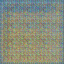

# LSGAN_Bird
 

> Implementation of LSGAN paper.
> Generate bird images as 128*128 pixel.

# Preview

  

# Original Paper
<a href="https://arxiv.org/abs/1611.04076" target="_blank">LSGAN Arxiv</a>

# Features
- Generate bird images as 128*128 pixel.
