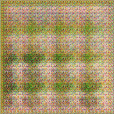

# LSGAN_Bird
 

> Implementation of LSGAN paper. 
> Generate bird images as 128*128 pixel.

# Preview

  <table>
    <tr align="center">
      <th>DCGAN</th>
      <th>LSGAN</th>
    </tr>
    <tr align="center">
      <td></td>
      <td></td>
    </tr>
  </table>

# Dataset

[25 Indian Bird species with 22.6k images](https://www.kaggle.com/datasets/arjunbasandrai/25-indian-bird-species-with-226k-images)

# Paper
[LSGAN Arxiv](https://arxiv.org/abs/1611.04076)

# Features
- Generate bird images as 128*128 pixel.
